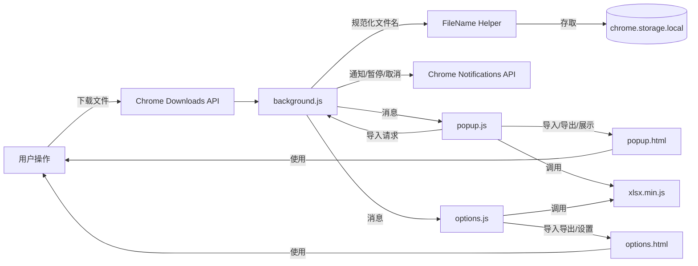
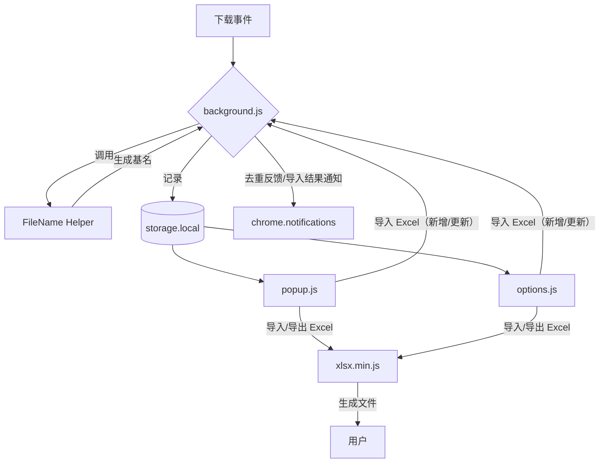
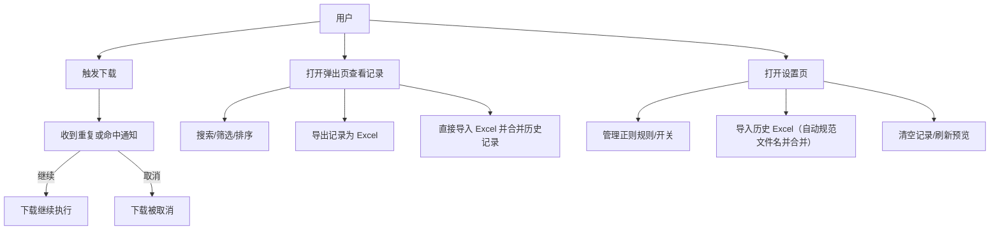

# DownEcho – 下载记录与去重助手

DownEcho 是一个基于 Chrome Extension Manifest V3 的下载记录管理插件。它能够监听浏览器的下载任务，自动记录元数据、检测重复与正则命中，并提供可视化的筛选、导入导出与通知提醒。

## 功能亮点
* 📥 实时监听下载任务，持久化存储文件名、大小、时间与来源。
* 🔁 多维度去重：按文件名、文件大小容差及命中过滤规则的相似名称均会提示，并记录详细原因。
* 🔍 弹出页提供搜索、过滤、排序、导出及“一键导入 Excel”的入口，可按偏好开关正则高亮与重复标识。
* ⚙️ 设置页可管理正则规则、主题、通知开关、自动清理等高级选项，并提供醒目的“导入 Excel”按钮与导入结果提醒。
* 📊 使用内置的轻量版 SheetJS 兼容层（`xlsx.min.js`）完成 Excel 导入与导出，导入时自动去重、更新并汇报新增及变更条目。
* 🗂️ 文件名统一规范：自动提取文件基名，移除系统下载目录前缀并解码 `%` 转义字符，确保历史导入与实时监听的记录格式一致。
* 🔔 通知系统自动回退到内置矢量图标，避免因缺失图像导致的“Unable to download all specified images”错误。

## 安装与使用
1. 在 Chrome 地址栏输入 `chrome://extensions/`，打开开发者模式。
2. 点击“加载已解压的扩展程序”，选择本项目目录 `DownEcho`。
3. 下载文件时，DownEcho 将自动记录并检测重复；命中规则时会弹出通知以供处理。
4. 点击扩展图标打开弹出页查看或导出记录；通过“扩展选项”进入设置页进行更精细的配置。

## 目录结构
```
DownEcho/
├── background.js        # Service Worker，负责下载监听、重复检测、通知与数据存储
├── manifest.json        # MV3 Manifest 配置
├── options.html/.css/.js# 设置页 UI、交互与导入导出逻辑
├── popup.html/.css/.js  # 弹出页 UI、过滤、排序与导出
├── xlsx.min.js          # 轻量 Excel 读写实现（兼容 SheetJS API 子集）
├── icons/               # 图标占位目录（请自行添加 icon16/48/128.png）
└── README.md            # 项目说明与架构图
```

## 架构概览
:::info
以下图示基于当前代码自动生成，覆盖架构、数据流、调用关系与用户用例视角。
:::

### 系统架构图


### 数据流图


### 调用图
```mermaid
sequenceDiagram
  participant DL as chrome.downloads
  participant BG as background.js
  participant FN as FileName Helper
  participant ST as storage.local
  participant POP as popup.js
  participant OPT as options.js
  participant XLSX as xlsx.min.js

  DL->>BG: onCreated/onChanged
  BG->>FN: extractFileName/normalizedName
  FN-->>BG: 基名/规范化结果
  BG->>ST: saveRecords/getRecords
  BG->>DL: pause/resume/cancel
  BG->>chrome.notifications: create/clear
  POP->>BG: GET_RECORDS/GET_SETTINGS
  POP->>BG: IMPORT_RECORDS(弹出页导入)
  POP->>XLSX: read, json_to_sheet, writeFile
  OPT->>BG: SAVE_SETTINGS/IMPORT_RECORDS(合并新增/更新)/CLEAR_RECORDS
  OPT->>XLSX: read, json_to_sheet, writeFile
  BG->>ST: setSettings
```

### 用户视角用例


## Excel 导入刷新指南
1. 在弹出页或设置页导出当前下载记录，按需在 Excel 中新增或调整文件条目。
2. 在弹出页点击“导入 Excel”按钮，或打开设置页使用同名按钮并选择修改后的 Excel 文件。
3. 扩展会自动解析文件名、解码 `%20` 等 URL 转义符，并与现有记录比对：
   * 若发现同名记录，则更新其大小、时间、来源与状态字段，即使命中了正则过滤规则也会同步刷新。
   * 若文件名不存在，则追加为新记录。
4. 导入完成后会弹出通知与提示，标明本次新增与更新的数量；刷新预览即可查看合并结果。

## 轻量版 SheetJS 说明
项目自带的 `xlsx.min.js` 兼容常用 SheetJS API（`json_to_sheet`、`sheet_to_json`、`book_new`、`book_append_sheet`、`writeFile`、`read`）。

- 写入：生成最小化的 XLSX 文件结构（Zip + OpenXML）。
- 读取：支持解析由本插件导出的 Excel 以及包含 inlineStr/数值单元格的简单工作表。
- 若遇到复杂格式或外部生成的特殊 XLSX，建议先转换为纯文本后导入。

## 测试建议
1. **重复检测**：尝试多次下载同名文件、大小相近文件，确认通知与暂停逻辑正确。
2. **正则匹配**：在设置页添加规则，下载命中文件，观察通知与记录标识。
3. **导入导出**：导出 Excel，再导入验证数据一致且无重复；导入第三方 Excel 时，确认能正确过滤重复项。
4. **通知交互**：在通知中点击“取消下载”，确认下载被终止且记录状态更新。

## 许可证
本项目使用 MIT License。详见 [LICENSE](LICENSE)。
